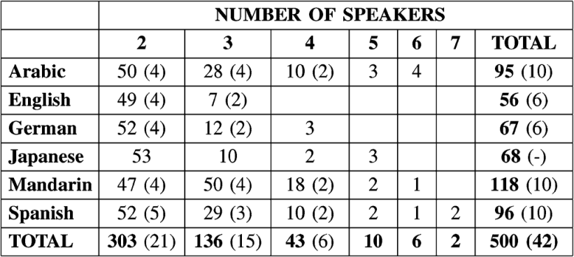
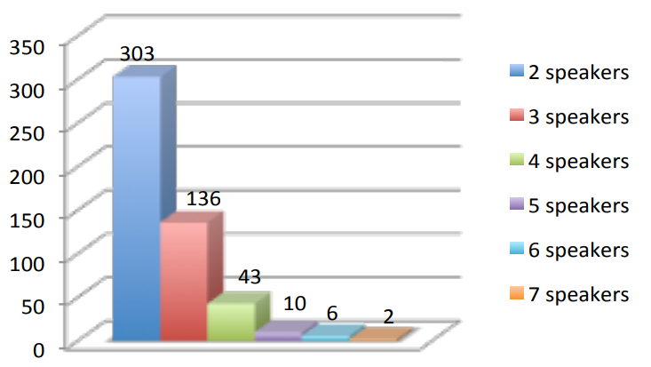

# callhome data

callhome是NIST SRE2000，多语言数据集，主要针对的是电话中多个说话人的对话场景，所有说话人都是在单一的声道中录制的，callhome包含了6种语言: 阿拉伯语，英语，德语，日语，汉语普通话和西班牙语。所有的音频基本上都是从长约30分钟的录音中截取的片段，所有的说话人都知道他们正在被录音，但是没有任何设计好的台词，音频中的内容都是随机自发的生活中普通的对话，虽然callhome收集的目的是所有的对话中都没有重复的说话人，但是还是有一小部分人在数据集中重复出现。

论文中用到的callhome测试集一共包括500个音频，是callhome数据集的子集，每个音频长度约为2-5分钟，包含了2-7个说话人。与测试集相关联的是开发集，开发集包含了42个音频，每个长度不小于5分钟，包含了2-4个说话人，除了日语，开发集包含了其余所有的5种语言。

下图显示了该集合具体的组成情况，分别统计了不同语言分类和不同说话人数量分类的音频个数，其中括号内记录的是开发集对应类别的音频个数，括号外记录的是测试集对应的个数。(两篇论文中dev集的音频数量不一致?)

    
    

有的论文中用到的callhome的英文测试数据集，与上面的测试集不同，是CALLHOME American English speech数据集(LDC97S42)，这个数据集包括了120个无剧本的电话对话音频，2个声道，采样率为8kHz，每个时长在30分钟左右，其中所有说话人的母语都是英语，音频数据多为家庭成员或是亲密朋友之间的对话。

