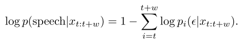
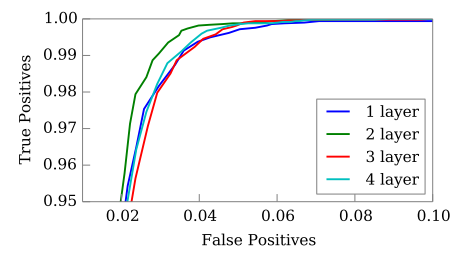
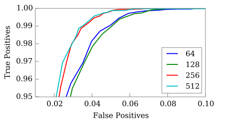
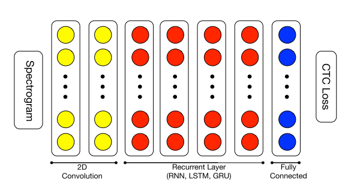
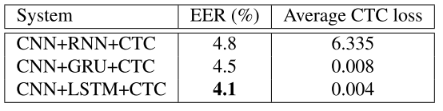
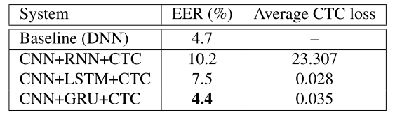
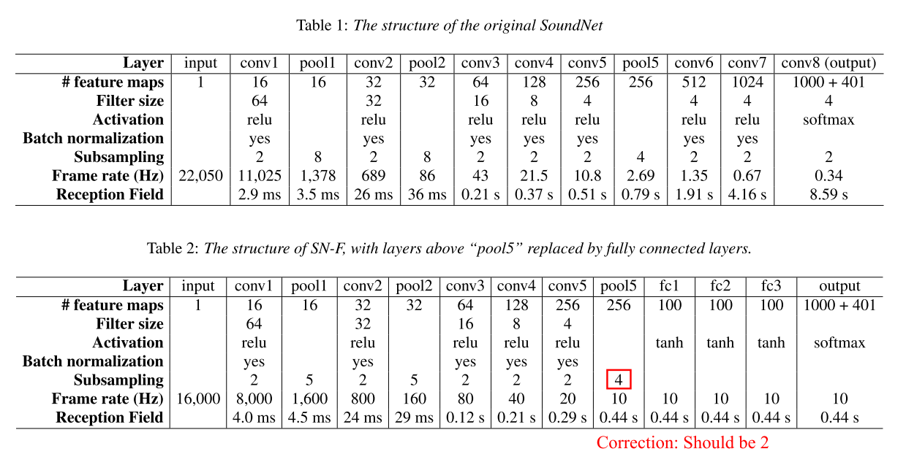
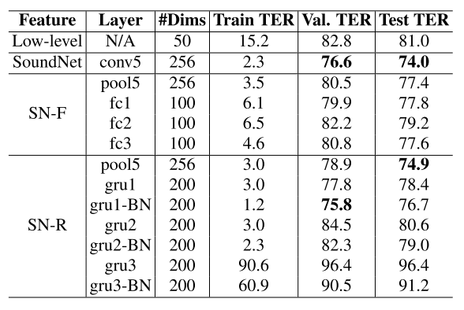

# CTC-VAD related paperlist

1.[An End-to-End Architecture for Keyword Spotting and Voice Activity Detection](https://arxiv.org/pdf/1611.09405.pdf)

对于 kws 任务，用 p(k|x) 建模，其中 k 是 keyword，x 是 speech。对于 VAD 任务，使用相同的建模方式，但把 k 替换成 silence，首先计算 no speech 的概率，然后可以用1减来得到 speech 的概率。

使用的网络结构，输入是8kHz的 rawwaveform，第一层是2维的卷积层，然后是3层RNN，最后一层是 affine transformation，然后接softmax，直接输出字典中的元素，包括 blank，可以通过下式来计算 VAD 的得分:

下面分别是增加隐层数量和大小的变化结果:

最后的结果准确率是99.8%
___

2.[NASAL SPEECH SOUNDS DETECTION USING CONNECTIONIST TEMPORAL CLASSIFICATION](http://publications.idiap.ch/downloads/papers/2018/Cernak_ICASSP_2018.pdf)

主要是用 ctc 做鼻音的检测，网络结构是 conv+recurrent+fc，中间尝试了三种结构 rnn，lstm，gru，最后的输出是 label {nasal, nonasal, space, blank}的softmax

在数据量足够的前提下，ctc比dnn得到了更好的效果，其中100h数据下gru最好，460h数据下lstm最好

___

3.[A FIRST ATTEMPT AT POLYPHONIC SOUND EVENT DETECTION USING CONNECTIONIST TEMPORAL CLASSIFICATION](https://ieeexplore.ieee.org/stamp/stamp.jsp?tp=&arnumber=7952704)

这篇paper是cmu的王赟用 ctc 做 SED(sound event detection)，在音频中事件的发生可能有重叠，难以定义事件发生的顺序序列，所以用事件的 boundaries (starts and ends) 来作为 ctc 的 tokens (For example, if the content of a recording could be described by a dog barks while a car passes by, we used the sequence engine start, animal start, animal end, engine end as the ground truth)，实验证明 ctc 可以在非常嘈杂的场景下定位事件的边界并且粗略的给出其具体位置，ctc看起来很适合检测短暂变化的声音事件，这种音频用传统的方法是比较难检测的。

使用的数据集是noiseme corpus，网络结构是 ctc-rnn，目标函数是 perframe negative log-likelihood，在训练的初始化阶段，ctc需要一个 warmup 的阶段，这个阶段只输出 blank tokens，为了减少这个阶段的时间，可以使用 bidirectional LSTM-RNN 来初始化隐层的 weight

最后的准确率是47.0%，在使用一些trick之后可以提升到 54.0%
___

4.[A Transfer Learning Based Feature Extractor for Polyphonic Sound Event Detection Using Connectionist Temporal Classification](http://www.cs.cmu.edu/~yunwang/papers/interspeech17.pdf)

这篇paper是上面ctc-sed的后续，把从大规模数据集中学到的知识加入到ctc中，paper中提到两种不同的 SoundNet, SoundNet 是一个把音频作为输入的很深的卷积网络，它可以作为ctc的特征提取器，输入的特征是由 SoundNet或者它的变种 SN-F 和 SN-R 提供

作者提到这种特征提取器的加入极大的加速了ctc网络的收敛，并略微改进了模型的泛化能力，其后ctc的部分与前一篇paper基本一致，结果如下:

