# speaker diarization 调研报告

## 任务定义
speaker diarization主要是一个针对多人对话场景中的说话人分割和聚类的任务，对于一段输入的音频流，首先要将其分割为多个只包含单个源的片段，然后再把对应于相同源的片段聚为一类，其中的"源"包括不同的说话人，音乐或者是背景噪声，也就是所谓的"鸡尾酒问题"

speaker diarization不同于说话人识别和语音识别，说话人识别是确定说话人的身份(who is speaking)，语音识别是获得说话人的语音内容(what spoken)，diarization是针对"who spoke when"的问题，主要目标就是正确的分割音频并将音频片段与相应的说话人对应，而不关注说话人的真实身份，所以这个任务包括了分割和聚类，也就是先找到音频流中说话人切换的change points，然后就是依据说话人的特征将音频片段进行聚类。

## 传统处理流程及系统分类
diarization系统的输入输出如下图所示，输入的是音频文件的特征，一般采用MFCC特征，然后进行分割，最后输出的是聚类之后的结果，也就是每一个段所对应的类别。

diarization系统的处理流程大致如下

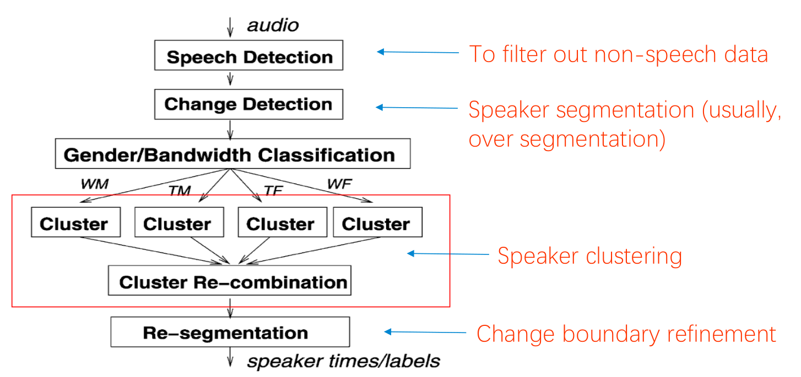

其中主要包括segmentation和clustering两个部分：

### Segmentation

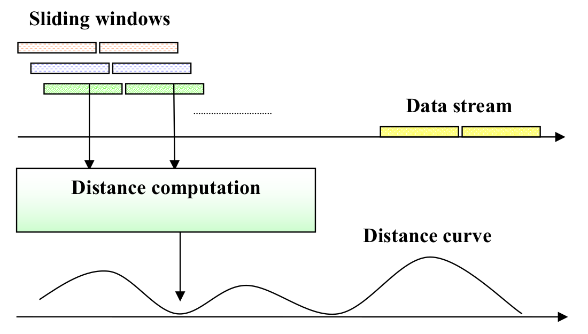

segmentation就是对于输入的音频特征的序列，首先可以用固定长度将其划分为连续的小窗口，窗口的长度可以根据任务的要求或者是数据的特点来进行调整，相邻的窗口之间可以有overlap，然后就从头开始依次计算每两个窗口之间的距离，然后设定一个阈值，当两个窗口之间的距离超过阈值时，可以认为是发现了一个change point，在此处进行分割。这种计算两个窗口之间距离的方法有很多，常用的有BIC和KL2 distance

### Clustering

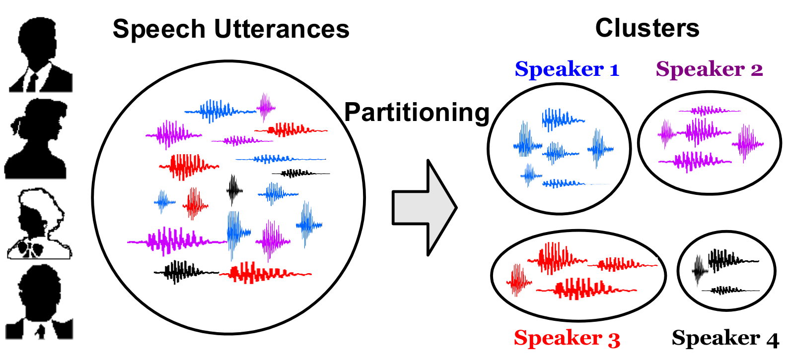

clustering的话就是把之前分割的语音片段进行聚类，把属于同一个说话人或者是同一类的片段聚到一起去，根据聚类方法的不同可以把diarization的系统分为两种：
- **bottom-up**
	自底向上的方法是在聚类的时候初始化较多的类(一般多于说话人的数量)，然后通过类的不断合并来达到聚类的效果
- **top-down**
	自顶向下的方法是初始化很少的类(通常为1)，然后通过类的分离来得到最后的结果

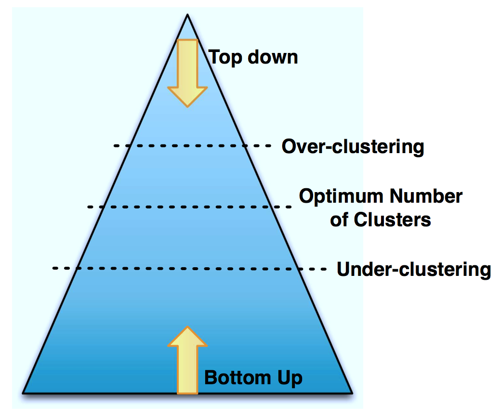

这两类系统都是通过迭代直至收敛来找到一个最优的类的个数。如果最后得到的类的个数大于真实类的个数，那么系统就是聚类不足的(under-clustering)，反之就是聚类过度(over-clustering)。现在比较流行的是**bottom-up**的系统，它可以得到更好的结果，top-down系统的特点是速度较快，计算复杂度低。

在bottom-up的系统中常用的聚类方法是Agglomerative hierarchical clustering(AHC)，可以理解为层次聚类方法

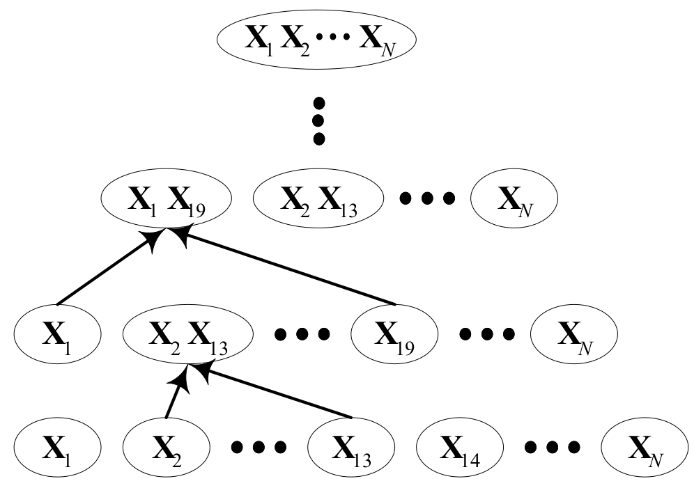

层次聚类方法的过程：
1. 初始化，将分割得到的每一个片段都设置为一个单一的类，设置表示参数(后面具体说明)
2. 计算所有类两两之间的距离(这里距离的计算后面会具体说明)
3. 找到距离最近的那两个类，并将它们合并成一个新的类
4. 更新类的参数并重新计算这个类与其余类的距离
5. 重复步骤3,4直到满足结束条件(这里的结束条件一般是类的个数减少到一定的数量)

### Optional
其余的就是一些optional的操作，包括可以在音频输入的时候加一个vad，目的是消除背景噪声和静音段的影响；或者是在segmentation之后加上一个比较粗略的分类，比如说可以将所有的片段分为male和female两部分，这样做的目的是在clustering的过程中可以使用不同的参数来进行自适应，可以提高聚类的准确性；还有就是在clustering之后可以再做re-segmentation来提高性能。

## 评价标准
diarization系统的评价标准主要是Diarization Error Rate (DER)，这个错误率包括了三种错误：
- missed speech (MS)
- false alarm (FA)
- speaker error (SE)

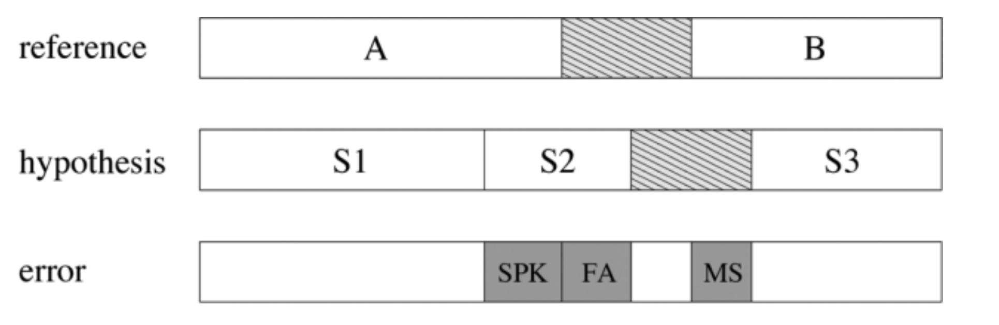

最终的DER的计算公式就是三种错误率的和: **DER = MS + FA + SE**

部分论文中使用EER，DCF？来评价结果，还有论文提出了一些新的边界评估框架

## 当前主要方法和改进
因为用的数据集不尽相同，所以没有方法之间详细的结果对比
### PLDA for i-vector 
[paper link](http://ieeexplore.ieee.org/stamp/stamp.jsp?arnumber=7078610)

这个方法的话主要就是在segmentation之后，对于每个segment计算一个i-vector用于表示这个片段，然后用PLDA的方法取代原来的cosine打分，来计算两个片段之间的距离，最后使用层次聚类的方法得到结果。

其中每个片段的长度大概是1-2s，然后迭代结束的条件是用无监督的标注方法得到的。在callhome数据集上的结果如图所示:

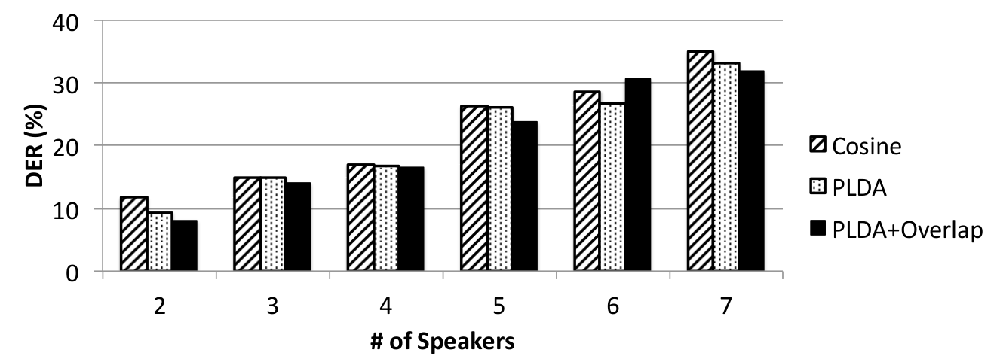

### DNN Embedding 
[paper link](http://www.danielpovey.com/files/2017_icassp_diarization_embeddings.pdf)

这个embedding的方法就是对于分割之后的每个segment，用定长的embedding向量来表示，避免了i-vector的计算

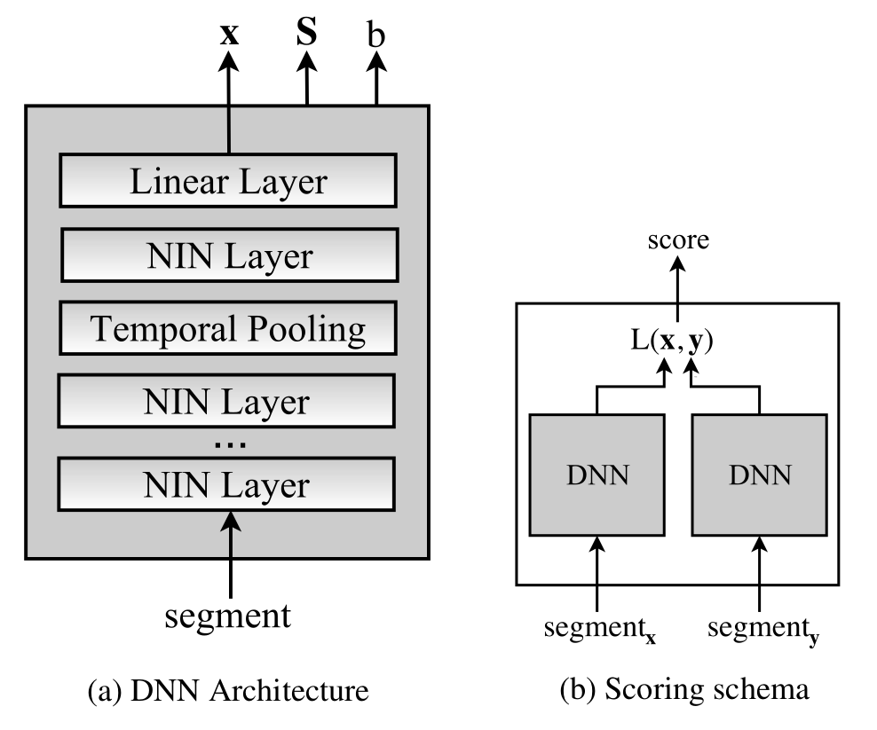

而所有的embedding向量是通过一个DNN的结构得到的，如下图所示，这个DNN的输入是每个segment的特征序列，输出的是一个固定维度(400)的embedding向量，同时还会输出一个对称矩阵S和一个偏置b，这两个输出会在计算两个embedding向量距离的时候用到，DNN中的NIN Layer表示network in network，是一种将大网络拆分的操作，可以加快DNN的速度。
两个embedding向量之间的距离定义如下，与PLDA相似:

在callhome上面最好的结果是DER=9.9%

### Embedding from DNN hidden layer 
[paper link](http://ieeexplore.ieee.org/stamp/stamp.jsp?arnumber=7362751)

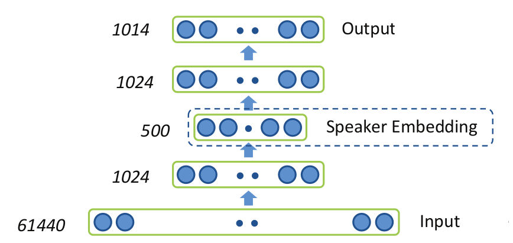

这个方法中embedding的方式和上面所说的那个不同，根据论文中所说的，考虑到在做说话人识别相关任务的时候，训练的DNN模型在隐层中压缩了很多相关的特征，所以可以从隐层神经元的激活状态中得到一个特征向量，如上图所示，具体的做法就是利用DNN结构中的某一个隐层来作为speaker embedding的向量，这个DNN的输入是从GMM-UBM得到的61440维的超向量

其中是第t帧属于第g个高斯分量的后验概率，表示第t帧，表示GMM-UBM的均值。

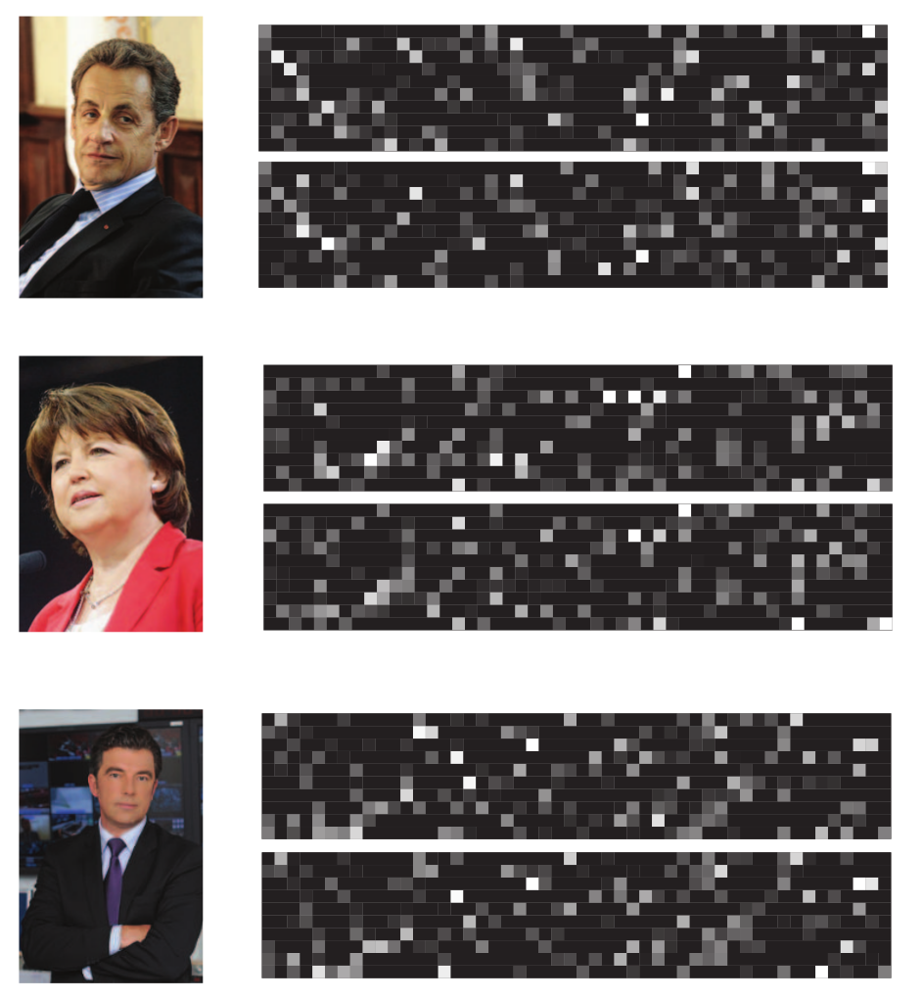

上面是所提取的embedding向量的例子，颜色越亮表示数值越高，每个说活人有两段提取的特征，可以每个说话人各自的特征还是有很多相似之处的
在ETAPE数据集上的结果:

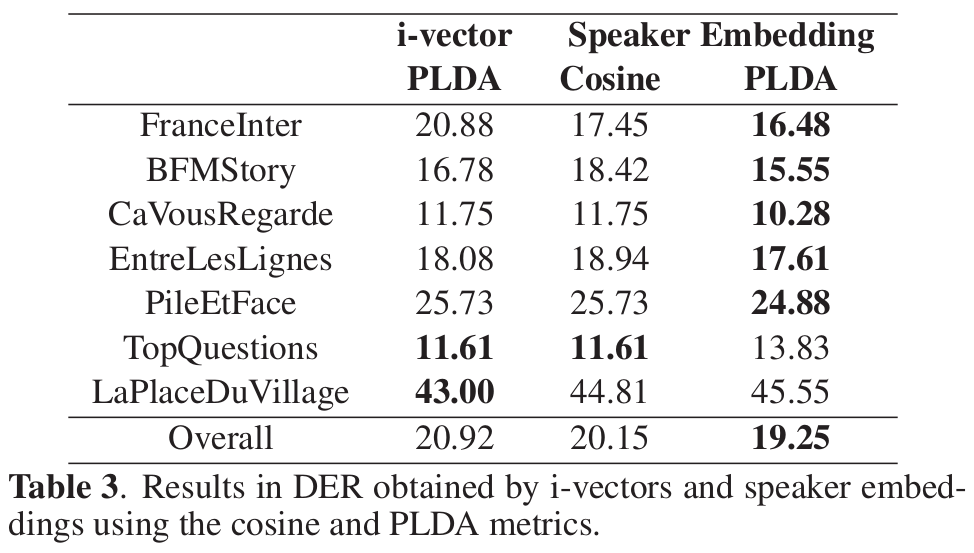

### Cross-show diarization 
[paper link](http://ieeexplore.ieee.org/stamp/stamp.jsp?arnumber=7472746)

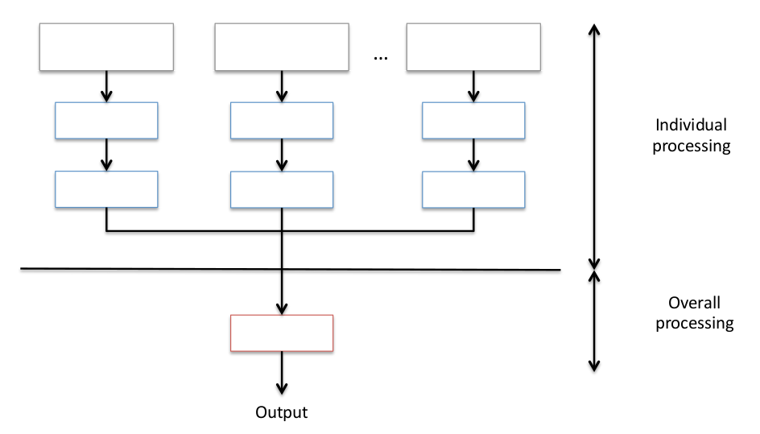

这种cross-show的方法是主要是在聚类上做了改变，论文中认为传统的AHC，也就是层次聚类的方法无法保证得到一个最优解，所以将聚类的问题转化成ILP (Integer Linear Programming)的形式，这里涉及到一些公式的推导，具体细节看论文，大概的意思就是这种聚类的方法与传统的bottom-up的方法不同，它是定义了一些辅助的隐变量，然后写出一个全局的目标函数，通过最小化类的个数和类内方差来进行计算。而cross-show的方法就是包含了两层的结构，第一层就是分离的操作，进行正常的分割和聚类，第二层利用IPL在全局上再进行一次重新的聚类。

这种方法在REPERE数据集上可以使得DER下降0.82%

## 难点和挑战
1. 在数据中会有多人同时说话(overlapping)的情况，是当前一个比较明显的问题，由overlapping带来的错误在最终的错误率中占有较大的比重，这种场景的增加会使得DER明显提高。现在的diarization系统对于overlapping也有一些初步的解决方法，例如通过HMM的状态转换来找出音频中overlapping的部分，然后处理overlapping部分的片段时保留多个结果

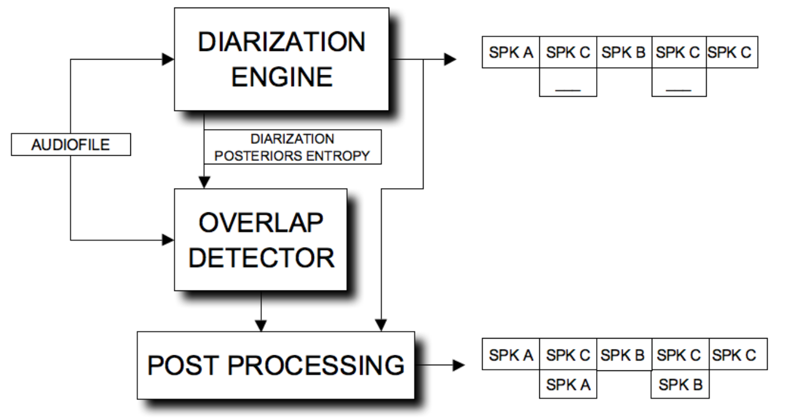

这些解决方法对于结果有一定的提高，但是有较为明显的局限性，需要假设所有overlapping的部分都是2个说话人重叠。

2. 数据集的微小变化会对diarization系统产生很大的影响，鲁棒性有待提高。
3. 目前diarization的方法不够成熟，普适性较差，无法适用于多个领域(新闻播报，客服电话等)

## 数据集
speaker diarization这个任务现在的一个主要问题就是数据集不统一，虽然都是做diarization，但是大家的motivation一般都不一样，所以对数据集的需求也就不一样，所以目前没有一个比较统一的主流数据集，在icassp和interspeech近两年的关于diarization的论文中，用的比较多的数据集有以下几个

### 1. CALLHOME conversational telephone speech corpus.
callhome数据集的出现频率最高，它的数据是家庭中的对话场景，CTS collection？所有说话人都是在单一的声道中录制的，每个音频中会有2-7个说话人(一般都是2-4个说话人进行对话)，这个数据集包含了6种语言: 阿拉伯语，英语，德语，日语，普通话和西班牙语。这个数据集主要使用来对训练好的模型进行evaluation，diarization系统中的训练和测试数据集一般都不相同，在训练的时候用的比较多的数据集是SRE，下面列举一些不同的数据集以及相应用到该数据集的论文(部分列举):
> **callhome全部数据**
> - [SPEAKER DIARIZATION USING DEEP NEURAL NETWORK EMBEDDINGS](http://www.danielpovey.com/files/2017_icassp_diarization_embeddings.pdf)
> - [SPEAKER DIARIZATION WITH PLDA I-VECTOR SCORING AND UNSUPERVISED CALIBRATION](http://ieeexplore.ieee.org/stamp/stamp.jsp?arnumber=7078610)
>
> **callhome英文数据**
> - [CONVOLUTIONAL NEURAL NETWORK FOR SPEAKER CHANGE DETECTION IN TELEPHONE SPEAKER DIARIZATION SYSTEM](http://ieeexplore.ieee.org/stamp/stamp.jsp?arnumber=7953097)
> - [Speaker Diarization Using Convolutional Neural Network for Statistics Accumulation Refinement](https://pdfs.semanticscholar.org/35c4/0fde977932d8a3cd24f5a1724c9dbca8b38d.pdf?_ga=2.29293308.1912056220.1516762318-1161727276.1516762318)
> - [SPEAKER DIARIZATION WITH LSTM](https://arxiv.org/pdf/1710.10468.pdf)

### 2. **NIST Rich Transcription evaluation in 2007** 
[NIST官网](https://www.nist.gov/itl)
> - [DNN APPROACH TO SPEAKER DIARISATION USING SPEAKER CHANNELS](http://ieeexplore.ieee.org/stamp/stamp.jsp?arnumber=7953093)

### 3. SRE
这个数据集主要用来训练GMM-UBM和PLDA，用的比较多的是SRE04，05，06，08
> - [SPEAKER DIARIZATION USING DEEP NEURAL NETWORK EMBEDDINGS](http://www.danielpovey.com/files/2017_icassp_diarization_embeddings.pdf)
> - [SPEAKER DIARIZATION WITH PLDA I-VECTOR SCORING AND UNSUPERVISED CALIBRATION](http://ieeexplore.ieee.org/stamp/stamp.jsp?arnumber=7078610)
> - [MULTI-SPEAKER CONVERSATIONS, CROSS-TALK, AND DIARIZATION FOR SPEAKER RECOGNITION](http://ieeexplore.ieee.org/stamp/stamp.jsp?tp=&arnumber=7953193)

### 4. IFLY-DIAR-II database 
这个数据集来自于中文的脱口秀，采样率是16kHz，每个音频会包含2-9个说话人，一般是一个主持人和多个嘉宾，说话人的转换比较频繁，重叠也经常发生，同时还存在一些音乐或者是背景噪声，该数据集包含了171个音频(86 hours)
> - [FEATURE MAPPING FOR SPEAKER DIARIZATION IN NOISY CONDITIONS](https://pdfs.semanticscholar.org/798c/3b5ac167ed47be10098a50dcd66f9ecee8dc.pdf)

### 5. REPERE & ESTER
这是两个法语数据集
> - [A Triplet Ranking-based Neural Network for Speaker Diarization and Linking](http://www.isca-speech.org/archive/Interspeech_2017/pdfs/0270.PDF)
> - [Combining speaker turn embedding and incremental structure prediction for low-latency speaker diarization](http://herve.niderb.fr/download/pdfs/Wisniewski2017.pdf)

## 参考论文
这里只列举了主要的参考文献，其他的还可以看icassp和interspeech近2年关于diarization的文章
> 1. [SPEAKER DIARIZATION USING DEEP NEURAL NETWORK EMBEDDINGS](http://www.danielpovey.com/files/2017_icassp_diarization_embeddings.pdf)
> 2. [SPEAKER DIARIZATION WITH PLDA I-VECTOR SCORING AND UNSUPERVISED CALIBRATION](http://ieeexplore.ieee.org/stamp/stamp.jsp?arnumber=7078610)
> 3. [SPEAKER DIARIZATION THROUGH SPEAKER EMBEDDINGS](http://ieeexplore.ieee.org/stamp/stamp.jsp?arnumber=7362751)
> 4. [INVESTIGATION OF SPEAKER EMBEDDINGS FOR CROSS-SHOW SPEAKER DIARIZATION](http://ieeexplore.ieee.org/stamp/stamp.jsp?arnumber=7472746)
> 5. [Speaker Diarization: A Review of Recent Research](http://www1.icsi.berkeley.edu/~vinyals/Files/taslp2011a.pdf)
> 6. [Speaker Diarization: Its Developments, Applications, And Challenges](http://eprints.undip.ac.id/36153/1/Hernawan_Sulity.pdf)
> 7. [An Overview of Automatic Speaker Diarization Systems](https://www.ll.mit.edu/mission/cybersec/publications/publication-files/full_papers/0511_Reynolds1.pdf)
> 8. [MULTI-SPEAKER CONVERSATIONS, CROSS-TALK, AND DIARIZATION FOR SPEAKER RECOGNITION](http://ieeexplore.ieee.org/stamp/stamp.jsp?tp=&arnumber=7953193)
> 9. [A Triplet Ranking-based Neural Network for Speaker Diarization and Linking](http://www.isca-speech.org/archive/Interspeech_2017/pdfs/0270.PDF)
> 10. [Combining speaker turn embedding and incremental structure prediction for low-latency speaker diarization](http://herve.niderb.fr/download/pdfs/Wisniewski2017.pdf)

