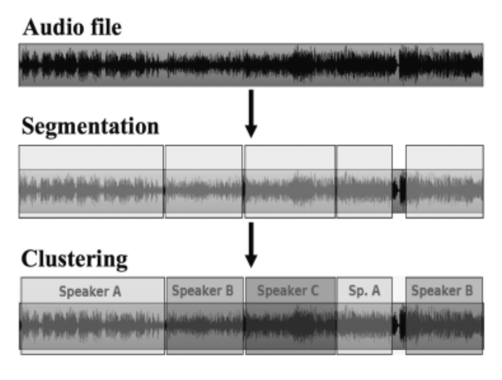

# diarization 调研报告

## 任务定义
speaker diarization主要是一个针对多人对话场景中的说话人分割和聚类的任务，对于一段输入的音频流，首先要将其分割为多个只包含单个源的片段，然后再把对应于相同源的片段聚为一类，其中的"源"包括不同的说话人，音乐或者是背景噪声，也就是所谓的"鸡尾酒问题"

speaker diarization不同于说话人识别和语音识别，说话人识别是确定说话人的身份(who is speaking)，语音识别是获得说话人的语音内容(what spoken)，diarization是针对"who spoke when"的问题，主要目标就是正确的分割音频并将音频片段与相应的说话人对应，而不关注说话人的真实身份，所以这个任务包括了分割和聚类，也就是先找到音频流中说话人切换的change points，然后就是依据说话人的特征将音频片段进行聚类。

## 处理流程及系统分类
系统的输入是音频文件的特征，然后进行分割，最后输出的是聚类之后的结果，也就是每一段对应哪一个类别。见图片

## 评价指标
评价的标准主要是Diarization Error Rate (DER)，包括了missed speech (MS)，false alarm (FA)，speaker error (SE)

DER = MS + FA + SE
见图片
Detection cost function

## 主要方法和性能对比
- 自底向上 bottom-up
- 自顶向下 top-down

## 难点和挑战

## 训练数据集
1. CALLHOME conversational telephone speech corpus. We evaluated our systems using the CALLHOME corpus, which is a CTS collection between familiar speakers. Within each conversation, all speakers are recorded in a single channel. There are anywhere between 2 and 7 speakers (with the majority of conversations involving between 2 and 4), and the corpus also is distributed across six languages: Arabic, English, German, Japanese, Mandarin, and
Spanish.
2. TBL is TV broadcast data which consists of 22 programmes from a talk–show with single distant microphone
(SDM) and IHM channels: four speakers as one host and three guests. The recordings have been split into a training
set of 12 programmes for DNN training only, and a test set of 10 episodes which has a total of 40 speakers and 8749 segments in 5.3 hours of speech time. The audio was manually transcribed to an accuracy of 0.1s
3. NIST Rich Transcription evaluation in 2007  https://www.nist.gov/itl
4. IFLY-DIAR-II database which is drawn from Chinese talk shows, and the sample rate is 16 kHz. The duration of the recordings in the IFLY-DIAR-II database vary from 20 minutes to one hour. The number of speakers in each recording ranges from 2 to 9, and there are generally one host and several guests. The speaking style is spontaneous and causal, and short conversation turns and overlapped speech are often encountered. Furthermore, the speech is corrupted by music, laughter, applause, or other noises. The training set contains 171 recordings (86 hours), the development set consists of 90 conversations (47 hours), and the test set contains 367 audio files (193 hours).
5. REPERE 2013 data ESTER
6. development MGB Challenge data set

## 参考论文
