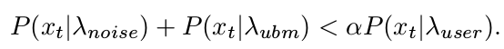
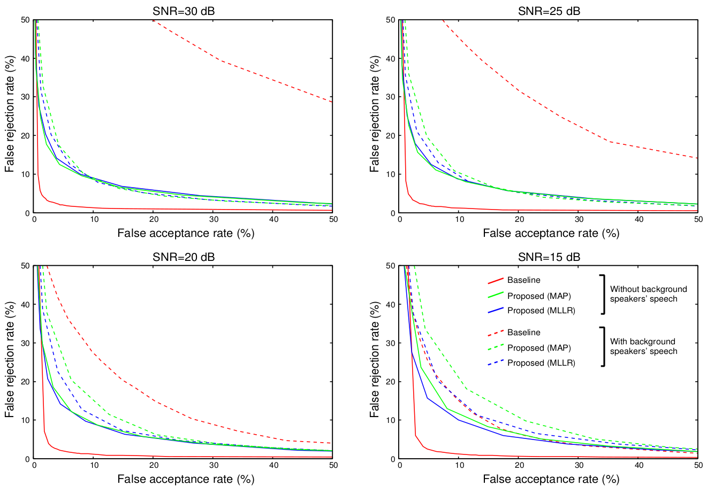
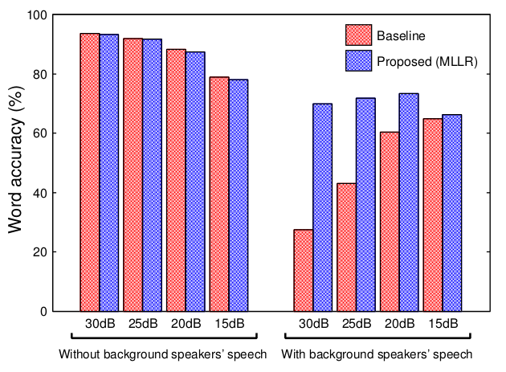

# Speaker Dependent vad

### 任务提出
**speaker-dependent vad** 这个task概念的提出是在2012年interspeech上的一篇paper

[Speaker-Dependent Voice Activity Detection Robust to Background Speech Noise](https://pdfs.semanticscholar.org/8abb/5c091ad3bc0f3df217f7b48ce1772eb59661.pdf)

#### 1. 目的  
从一个手机app ("VoiceTra", kind of speech-to-speech translation)上收集的大量数据中发现，识别结果中大多数的字插入错误都是由背景噪声中其他人的说话声引起的，为了去除其他人声的影响，提出了针对特定说话人的 vad 来对音频进行过滤。

#### 2. 方法  
提出的 vad 系统使用的是传统的GMM方法，包含了3个GMM:

- noise GMM
- speaker-independent GMM (ubm)
- speaker-adapted GMM

与当时的传统方法的区别就是加上了一个 **speaker-adapted GMM**，自适应的方法使用了 **MAP** 和 **MLLR**，每一帧的分类是通过以下公式来判别的：  

#### 3. 数据集
- `speaker-independent GMM` 训练集:  
    5h的对话语音(from ATR travel arrangement task database, "TRA")和25h的阅读语音(from TRA-BLA)，其中包含了400个speaker，26000个sentence，同时随机加上了15种噪声

- 测试集:  
    basic travel expression corpus (BTEC)，其中有male，female各20名，每个说话人有大约300个sentence，使用200个来做 `speaker adaptation`，剩下100个来测试

- 这些数据并没有找到可以下载的地方，也很少被使用

#### 4. 实验结果
- **vad**的结果(实线是没有背景人声，虚线是有背景人声，baseline是传统的有前两个GMM的模型)  

可以看出来没有背景人声的时候都是baseline最好，有背景人声的时候论文提出的方法效果更好

- **asr**的结果趋势一致

### 类似的任务
- 调研这个任务的时候，在google上搜索 **"speaker-dependent vad/sad ..."** 的时候，出来的主要就是上面的那篇论文，用的是传统的方法，其余的都是不太相关的，没有看到比较近的用DL方法做的论文，觉得不太可能，就花时间刷了一遍2012-2018的icassp和interspeech的论文，确实没有一模一样这个task的论文，但是有些效果部分类似的paper，例如icassp 2013年的:  
[TARGET SPEAKER SEPARATION IN A MULTISOURCE ENVIRONMENT USING SPEAKER-DEPENDENT POSTFILTER AND NOISE ESTIMATION](https://ieeexplore.ieee.org/stamp/stamp.jsp?tp=&arnumber=6639071)  
这篇paper就是做在嘈杂环境中目标说话人的分离，主要用了一些信号和数学的方法，类似任务的paper还有一些，总结就是主要是信号里面的一些方法，例如声源定位，还有噪声抑制，语音增强等等，大部分没有针对特定的speaker，但是其中也可能会涉及到类似于speaker dependent speech enhancement的方法，或者有类似的提取target说话人的效果

- 另外一点就是我过的许多speaker recognition的论文里面也都会用vad来进行预处理，以得到更好的说话人识别的效果，或者是speaker verification的任务，这些好像和speaker-dependent vad任务的目标也比较类似
